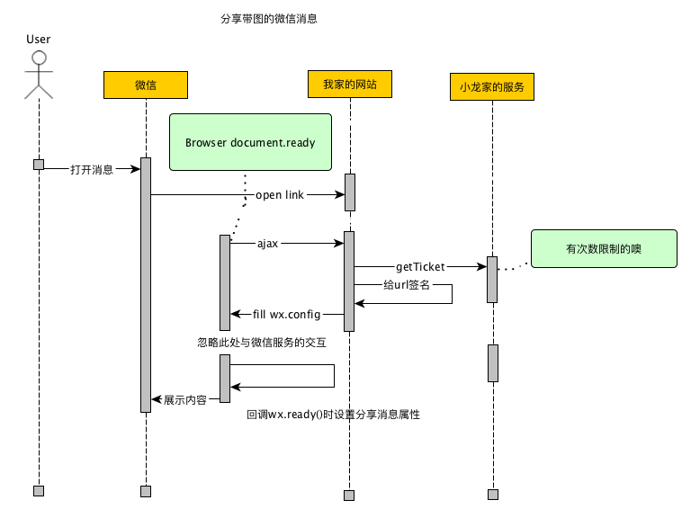

# 微信分享

## 利用微信JS-SDK获得微信分享能力

JS-SDK是微信提供的一个网页开发工具包；开发者需要正确接入JS-SDK，才能使用微信分享能力

```bash
微信JS-SDK是微信公众平台 面向网页开发者提供的基于微信内的网页开发工具包。

通过使用微信JS-SDK，网页开发者可借助微信高效地使用拍照、选图、语音、位置等手机系统的能力，同时可以直接使用微信分享、扫一扫、卡券、支付等微信特有的能力，为微信用户提供更优质的网页体验。
```

## JS-SDK使用步骤

* 步骤一：绑定域名(前提条件)
* 步骤二：引入JS文件: http://res.wx.qq.com/open/js/jweixin-1.2.0.js

* 步骤三：通过config接口注入权限验证配置
* 步骤四：通过ready接口处理成功验证
* 步骤五：通过error接口处理失败验证



## 详细介绍

* `public/index.js` 引入JS文件；ajax(jquery.js)调用后台sign接口，获得当前页面的验签
* `public/js/wechat_share.js` 封装wx.config/wx.ready等接口
* `index.js` app.get('/sign', callback) 获取wx.config这个验签对象

## 运行
```bash
➜  wechat_share git:(master) npm run dev

> wechat_app@1.0.0 dev /opt/local/ide/workspaces/w2016/wechat_share
> DEBUG=sign node index.js

wechat app is running at localhost:3003
GET / 304 3.957 ms - -
GET /js/wechat_share.js 304 1.282 ms - -
  sign req.query.url = %S http://localhost:3003/ +0ms
  sign getJsConfig +318ms
  sign config => {"debug":false,"appId":"wx8bfd84bd9aa54b75","timestamp":"1517196579","nonceStr":"wevxmghyxm","signature":"38ab69a7ac6737a5f088e3b41253f51ba910c4f9","jsApiList":["onMenuShareTimeline","onMenuShareAppMessage","onMenuShareQQ","onMenuShareWeibo","onMenuShareQZone"]} +0ms
GET /sign?url=http%3A%2F%2Flocalhost%3A3003%2F 200 319.806 ms - 262
```